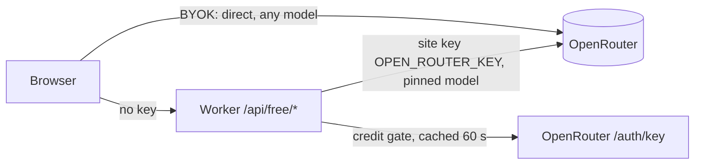

# Free Tier — Chat on the Site's OpenRouter Credit

Every visitor can chat in the Copilot for free — **no login, no personal
data** — funded by the site's own OpenRouter key (`OPEN_ROUTER_KEY` in the root
`.env`). The throttle is the **credit on that key**, not a per-user quota: free
chats run until the balance is spent. When it's out, visitors fall back to the
existing "Connect OpenRouter" BYOK flow. BYOK stays available **from the get-go**
for anyone who wants a different model — a browser that already holds a key
never touches the free path.

The site already runs BYOK (the user's OpenRouter key lives in their browser
and talks to OpenRouter directly). "Free chats on our dime" inverts that: the
site's own key must serve anonymous users, which means those chats have to
**proxy through the Worker**. This plan keeps the whole agent loop client-side
and adds a thin OpenAI-compatible proxy + credit gate in the Worker, so the
existing `ai.ts` loop code barely changes. **No new storage** — no fingerprint
identity, no D1 table, no per-chat counting; the OpenRouter dashboard and the
quota endpoint are the accounting.



## 1. Access model — open, credit-gated

No login, no fingerprint, no per-user quota. The finite credit pool is the
natural throttle, and honest users never get blocked by it — the pool only
shrinks when people actually chat.

- The free path runs **only when the browser has no key** (`getApiKey()` empty,
  `ai.ts:1706`). BYOK users bypass it entirely.
- Nothing about the user is stored or logged beyond what Cloudflare already
  keeps; no cookies, no D1 rows. The privacy note in Settings becomes one line:
  *"Free chats are paid for by this site's OpenRouter credit — no account, and
  we store nothing about you."*
- Abuse is a spent-credit problem, not a quota problem: mitigations are the
  Turnstile gate + IP rate limits on `/api/free/*` when farming shows up (§6.4),
  plus OpenRouter dashboard spend alerts. This stops casual abuse, not a
  determined attacker — accepted trade for zero-friction anonymous access.

## 2. The credit gate (quota model)

The gate is the **remaining balance on the site's OpenRouter key**, read live
from OpenRouter's key-info endpoint:

```
GET https://openrouter.ai/api/v1/auth/key
Authorization: Bearer $OPEN_ROUTER_KEY
→ { "data": { "label", "usage", "limit", "limit_remaining", "is_free_tier", "rate_limit" } }
```

- `remaining = limit_remaining ?? (limit - usage)` (USD). Gate **open** iff
  `remaining > 0 && !is_free_tier` — `is_free_tier: true` means the key has no
  purchased credits and OpenRouter would serve the unfunded free tier (50
  req/day); that's not "our credit", so it counts as exhausted. The key must be
  funded with credits for free mode to run.
- Balance is cached in-isolate ~60 s (reuse the existing `cached()` helper), so
  the gate is **soft**: worst-case overshoot between checks is pennies, and
  users never get false 402s. No check-then-insert race, no per-user rows.
- Exhausted ⇒ `402` with `{ error: { code: "free_credit_exhausted", remaining: 0 } }`.
  Topping the key back up re-opens free mode with **no redeploy** — the gate is
  a live balance, not a stored counter.
- Dev/test override: optional var `FREE_CREDIT_EXHAUSTED` = "1" forces the 402
  so the exhausted path can be verified (and e2e'd) without draining the key.

## 3. Worker changes (`worker/src/index.ts`)

### New endpoint: `POST /api/free/v1/chat/completions`

An OpenAI-compatible pass-through, streaming SSE back (`stream: true` always).
This is intentionally a byte-level proxy of the OpenAI protocol — the browser's
existing `@tanstack/ai` loop, tool-call parsing, reasoning-delta handling and
streaming UI work **unchanged**. Steps:

1. Parse body (`model`, `messages`, `tools`, `max_tokens`). **Force**
   `model = FREE_MODEL` (`~deepseek/deepseek-v4-flash-latest` — the alias, so
   the free tier follows price drops; allowlist reject anything else) and clamp
   `max_tokens` to `FREE_MAX_OUTPUT_TOKENS = 4096` (reasoning tokens count
   against this on OpenRouter — this is the per-chat spend cap).
2. Credit gate (§2). Exhausted ⇒ `402 free_credit_exhausted`.
3. Forward to `https://openrouter.ai/api/v1/chat/completions` with
   `Authorization: Bearer ${env.OPEN_ROUTER_KEY}` and `HTTP-Referer` +
   `X-Title` (OpenRouter attribution, same as the BYOK path). **Drop any client
   `Authorization` header** — the site key never leaves the Worker and never
   reads a browser-supplied key.
4. Return the upstream response through `cors()` so the browser sees the SSE
   stream. Body untouched (no usage rewriting — accounting is the balance).

### New endpoint: `GET /api/free/quota`

`{ remaining, limit, is_free_tier, model }` — from the cached balance. Powers
the UI chip ("Free credit: $1.42 left").

### Plumbed bits

- `Env`: add `OPEN_ROUTER_KEY: string` (secret), vars `FREE_MODEL`,
  `FREE_MAX_OUTPUT_TOKENS`, optional `FREE_CREDIT_EXHAUSTED`.
- **Key plumbing (the `.env` convention):** locally, `OPEN_ROUTER_KEY` lives in
  the root `.env` (gitignored — set, line 13). Mirror it into
  `worker/.dev.vars` so `npx wrangler dev` picks it up — exactly the existing
  convention for `TAVILY_API_KEY` / `FRED_API_KEY` (gitignored; the tracked
  `.dev.vars.example` documents the name). Production: `wrangler secret put
  OPEN_ROUTER_KEY`, mirrored as a GitHub secret for the `Deploy → dev` /
  preview deploys (same as `TAVILY_API_KEY`). Never commit the value, never
  echo it in logs.
- `cors()`: **no change needed** — it already advertises `Content-Type`, which
  is all the free endpoints send (the previous design's `X-Fingerprint` /
  `X-Chat-Id` headers are gone).
- Routing: two `if (path === …)` arms in `handle()` next to the other `/api/*`
  routes. No router infrastructure needed.
- Observability: log `{ model, outputTokens, httpStatus }` per completion
  (that's all — there is no user data to redact).

### Tool cost gating (the part that actually saves money)

The metered Tavily tools (`get_news`, `web_search`) hit **our** Tavily key —
free users must not burn the 1,000-credit monthly pool. The cheap tools stay:
`run_query`, `check_schema`, `list_frames`, `filter_frame`, `refresh_frame`,
`render_chart`, `eco_calendar` (FRED is keyless-free). Handled client-side
(§4) — no Worker change needed since the tools call the same `/api/*` endpoints
all anonymous visitors already use.

## 4. Frontend changes

### `frontend/src/ai.ts`

- `askAi()`: stop throwing when `getApiKey()` is empty (line 1707 today) — run
  the **free path** instead. Extract the OpenAI client construction in
  `runAgent()` (line ~1471):
  ```ts
  const baseURL = apiKey ? OPENROUTER_BASE : `${API_BASE}/api/free/v1`;
  // free: apiKey = 'free' (ignored server-side), model = FREE_MODEL
  ```
  Everything downstream (tools, loop, progress events) is untouched.
- Free mode drops `getNews` + `webSearch` from the `tools` array and appends a
  prompt line ("web search and news are unavailable in the free tier").
- Map `402` to a typed error `FreeCreditExhausted` instead of the generic
  failure, so the UI can pivot to the connect gate.
- Model handling: free path **ignores** `getModel()` and sends `FREE_MODEL`
  (server re-validates). BYOK path unchanged — model picker, reasoning-effort,
  everything, since BYOK stays available from the start.

### `frontend/src/api.ts`

`freeQuota(): Promise<{ remaining, limit, is_free_tier, model }>` (GET). Chat
completions go through the OpenAI client, not this file.

### `frontend/src/AiChat.tsx`

- **No-key state now chats.** Today it blocks submit and forces the connect
  panel (line ~311); instead the input is active and sends through the free
  path. The welcome "Connect OpenRouter" panel becomes a quiet hint — BYOK is
  optional, for people who want their own key/model.
- Credit chip next to the model selector when no key: "Free credit: $1.42
  left" (from `freeQuota`, fetched on mount + polled/refreshed after each
  chat; hide when `is_free_tier` with 0).
- Exhausted state (`FreeCreditExhausted` or chip at 0): the input is gated with
  a "Free credit's out — Connect OpenRouter to keep chatting" CTA — reuses the
  existing connect flow (`startOAuthFlow` / key paste). When a key appears, the
  chip disappears and the BYOK path takes over.
- Settings gets the one-line privacy note (§1).
- Follow `frontend/AGENTS.md` design-system rules for all UI additions.

### Tests

- Existing e2e (`copilot-tools.spec.ts`) injects a BYOK key → runs the paid
  path, **unaffected**.
- New spec `free-chat.spec.ts`: anonymous chat works (skip-gated on a local
  key being present in `worker/.dev.vars`, like the existing KEY gating);
  credit chip renders; **exhausted path without spending credit** — Playwright
  route-stub `/api/free/quota` → `{ remaining: 0 }` (and/or the
  `FREE_CREDIT_EXHAUSTED` worker var) → 402 → connect gate appears.
- Worker has no test runner — verification is `npx wrangler dev` + curl (§6).

## 5. Cost math

`~deepseek/deepseek-v4-flash-latest` (currently = V4 Flash 0731): $0.08/1M in,
$0.252/1M out. Agent loop profile: ~50–100k input + 3–8k output per chat
(system prompt + schema + tool context re-billed per iteration) → **~$0.006
per chat, ~$6 per 1,000 chats**.

- Per-chat hard ceiling: 4,096 output tokens ≈ $0.001 + input ≈ $0.004–0.008 →
  ~$0.006–0.01.
- **$10 of credit ≈ ~1,000–1,600 chats.** Free mode ends when the balance is
  spent; topping up re-opens it. No per-user cap anymore — the recommendation
  is to fund the key with a monthly budget (OpenRouter credit cap or manual
  top-up) and let the balance be the kill-switch.
- Tavily excluded from the free toolset keeps the fixed 1,000-credit pool out
  of the spend path entirely.

## 6. Acceptance criteria / verification

1. `npx wrangler dev` (key in `worker/.dev.vars`) + curl: `GET /api/free/quota`
   returns `remaining` that matches the key's balance on the OpenRouter
   dashboard.
2. curl: `POST /api/free/v1/chat/completions` with a minimal OpenAI body
   streams an SSE completion for the allowlisted `~deepseek/deepseek-v4-flash-latest`.
3. With `FREE_CREDIT_EXHAUSTED=1` (or a drained throwaway key): completions
   return `402 free_credit_exhausted`, quota shows `remaining: 0`.
4. BYOK path untouched: existing e2e suite green; the free proxy **ignores**
   any client auth header (only the site key is ever used).
5. Free-mode UI: no key → chat works and streams (reasoning + tools), chip
   shows credit; at 0 → connect gate with "Free credit's out" copy; pasting a
   key immediately restores the full tool suite + model picker.
6. Top the key back up → free mode re-opens with no redeploy.
7. Preview deploy (`https://<branch-slug>.robs-options-slop-dev.pages.dev/`)
   returns HTTP 200 and `/api/free/quota` answers from the deployed Worker
   (with `OPEN_ROUTER_KEY` set as a Worker secret).

## 7. Suggested order (all small, reviewable PRs)

1. **Worker proxy + credit gate** (env wiring, endpoints, secrets) — the whole
   backend, curl-verified. No frontend dependency.
2. **Frontend free path** (`ai.ts` no-key branch, `api.ts` quota) — chat works
   anonymously end-to-end.
3. **UI polish** (`AiChat.tsx` chip + exhausted gate + privacy note) + `free-chat.spec.ts`.
4. *(Optional)* Turnstile gate on `/api/free/*` + IP rate limits once farming
   shows up; OpenRouter dashboard spend alerts on the key.

## Risk register

| Risk | Mitigation |
|---|---|
| Farming / scripted clients drain the credit pool | Turnstile gate on `/api/free/*` + IP rate limits when it shows up; OpenRouter spend alerts; balance is rewritten by topping up. Finite pool is the accepted throttle |
| Soft gate (60 s cached balance) lets a burst overshoot | Benign — pennies between checks; never under-serves |
| `~latest` alias drifts price/model behavior | Allowlist is one constant; re-check quarterly (alias currently = 0731, same price) |
| Free users burn Tavily (metered) | `get_news`/`web_search` excluded from free toolset |
| Balance hits 0 mid-chat | 402 on the next loop request; client treats it as that chat failing and pivots to the connect gate with clear copy |
| Key on unfunded free tier (`is_free_tier`) | Gate reports exhausted; plan note: key must carry purchased credits for free mode to run |
| Site key exposure | Key lives only in Worker env; client auth always dropped; dashboard usage is the canary; never in the frontend bundle |