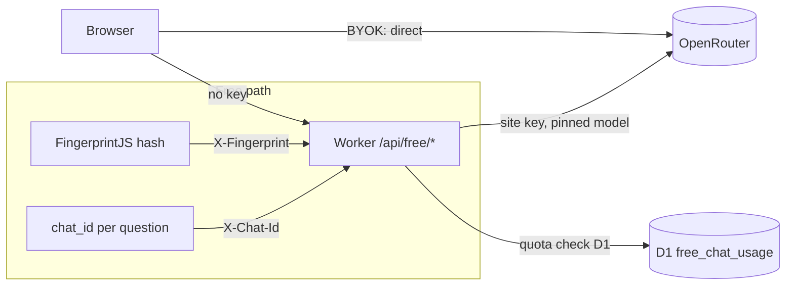

# Free Tier — 10 Anonymous Chats per Browser

Give every visitor 10 free Copilot chats **without a login and without any
personal data**. After the 10, they hit the existing "Connect OpenRouter" BYOK
flow — nothing about the paid path changes.

The site already runs BYOK (the user's OpenRouter key lives in their browser
and talks to OpenRouter directly). "Free chats on our dime" inverts that: the
site's own OpenRouter key must serve anonymous users, which means those chats
have to **proxy through the Worker**. The plan below keeps the whole agent loop
client-side and adds a thin OpenAI-compatible proxy + quota layer in the
Worker, so the existing `ai.ts` loop code barely changes.



## 1. Identity without login

No login, no personal data. Quota needs a stable-enough anonymous key.

| Option | Verdict | Why |
|---|---|---|
| Cloudflare Fingerprinting (`cf-fingerprint` header) | **Verify at implementation** | Launched Sept 2025, but the docs are no longer in Cloudflare's docs index today (both `fundamentals/fingerprinting/` and WAF/bots pages 404; `bots/llms.txt` + `waf/llms.txt` have zero hits). May have been folded into Bot Management. If the dashboard toggle exists on our account, it's the **preferred** option — zero client code, edge-computed, works without JS. 5-minute dashboard check. |
| JA3/JA4 fingerprint, JavaScript Detections | No | Both require Enterprise Bot Management (verified in current docs). |
| Turnstile | Used as a **gate**, not an identity | Free plan (verified), invisible mode, no personal data. Proves "human-ish", returns no stable user id. Use on the free endpoint to stop scripted farming. |
| FingerprintJS Open Source (client-side fingerprint) | **Primary in this plan** | MIT, ~50 kB, canvas/WebGL/audio/fonts hash. Sent as `SHA-256(fingerprint)` hex. Best-effort stable per browser; rotates on updates/incognito. Exactly the right trade for "deter casual abuse, never block honest users". |
| IP (`CF-Connecting-IP`) | Backstop only | NATs/CGNAT lump strangers together (false 402s); VPNs rotate. Use for global rate limits, never the quota key. |

**What we store:** only `SHA-256(fingerprint)` hex, `chat_id`, and an epoch `used_at`.
No raw fingerprint, no IP, no cookies, no email. Document that in the settings
UI ("Anonymous — no account, we only store a hash of your browser's
fingerprint to count chats").

**Honest expectation:** this stops casual abuse, not a determined attacker.
A fingerprint is not identity — anyone technical can reset it. That is the
accepted trade for zero-friction anonymous access; state it in the plan review.

## 2. Quota model

- **10 chats per fingerprint per rolling 30-day window** (`FREE_CHAT_LIMIT`,
  `FREE_CHAT_WINDOW_DAYS` — vars, tunable to "lifetime" by setting window to a
  large constant).
- A "chat" = one user question = one agent loop. Cost-control features below
  make the boundary meaningful.
- Counted **server-side in D1** (the Worker already has `SCHEMA_DB` + a
  migrations dir — no new infra).

**How a chat is counted with a stateless proxy:** the client generates a
`chat_id` (UUID) per question and sends it as an `X-Chat-Id` header on every
loop request belonging to that question. The Worker records a row only on the
**first request for that `chat_id`** (INSERT only if absent). Later loop
iterations (tool calls, retries, final answer) pass through, so a multi-step
agent loop that makes 5 HTTP calls costs 1 chat. `chat_id` forgery buys
nothing — the row is keyed to the fingerprint, and a new `chat_id` still
consumes quota for that fingerprint.

**D1 migration `0002_free_chat_usage.sql`:**

```sql
CREATE TABLE IF NOT EXISTS free_chat_usage (
  fingerprint TEXT NOT NULL,
  chat_id     TEXT NOT NULL,
  used_at     INTEGER NOT NULL,
  PRIMARY KEY (fingerprint, chat_id)
);
CREATE INDEX IF NOT EXISTS idx_free_chat_usage_fp
  ON free_chat_usage (fingerprint, used_at);
```

Quota check: `SELECT COUNT(*) WHERE fingerprint = ? AND used_at > now - window`
→ at limit? 402. Else `INSERT OR IGNORE`. The check-then-insert race can
over-count by one (two simultaneous first requests) — benign direction (we
over-pay, users never under-pay). Old rows pruned lazily (DELETE on a 1%
sample of quota checks; window is 30 days so table stays tiny).

## 3. Worker changes (`worker/src/index.ts`)

### New endpoint: `POST /api/free/v1/chat/completions`

An OpenAI-compatible pass-through, streaming SSE back (`stream: true` always).
This is intentionally a byte-level proxy of the OpenAI protocol — the browser's
existing `@tanstack/ai` loop, tool-call parsing, reasoning-delta handling and
streaming UI work **unchanged**. Steps:

1. `X-Fingerprint` header (SHA-256 hex) → miss ⇒ 403 (or serve quota UI data
   only). `X-Chat-Id` header → miss ⇒ 400.
2. Quota check (D1, §2). Exhausted ⇒ `402` with
   `{ error: { code: "free_quota_exhausted", remaining: 0 } }`.
3. Body: parse `model`, `messages`, `tools`, `max_tokens`. **Force**
   `model = FREE_MODEL` (`~deepseek/deepseek-v4-flash-latest` — the alias, so
   the free tier follows price drops; allowlist reject anything else) and
   clamp `max_tokens` to `FREE_MAX_OUTPUT_TOKENS = 4096` (reasoning tokens
   count against this on OpenRouter — this is the per-chat spend cap).
4. Forward to `https://openrouter.ai/api/v1/chat/completions` with the site's
   `OPENROUTER_API_KEY` secret (new), `HTTP-Referer` + `X-Title` headers
   (OpenRouter attribution, same as the BYOK path). Client auth is **ignored**
   — the site key never leaves the Worker.
5. Return the upstream response through `cors()` so the browser sees the SSE
   stream. Pass through `upsert_usage`? No — keep the body untouched except for
   `model`/`max_tokens`; **swallow the `usage` event from the final stream
   chunk** (accumulate output tokens per chat into the D1 row for cost
   accounting, Phase 2 uses it).
6. Record the chat row (`INSERT OR IGNORE`, `ctx.waitUntil`-style, non-blocking).

### New endpoint: `GET /api/free/quota`

`{ remaining, limit, window_days, model }` — powers the UI chip
("9 free chats left"). Same fingerprint header requirement.

### Plumbed bits

- `Env`: add `OPENROUTER_API_KEY: string` (secret), vars `FREE_CHAT_LIMIT`,
  `FREE_CHAT_WINDOW_DAYS`, `FREE_MODEL`, `FREE_MAX_OUTPUT_TOKENS`.
- `cors()`: extend `Access-Control-Allow-Headers` to
  `Content-Type, X-Fingerprint, X-Chat-Id` (the `X-*` headers make the POST a
  non-simple request → preflight must advertise them).
- Routing: two `if (path === …)` arms in `handle()` next to the other `/api/*`
  routes. No router infrastructure needed.
- Observability: log `{ fingerprintHash, chat_id, model, outputTokens }` per
  chat (hash only — never the raw fingerprint). Worker observability is
  already on.

### Tool cost gating (the part that actually saves money)

The metered Tavily tools (`get_news`, `web_search`) hit **our** Tavily key —
free users must not burn the 1,000-credit monthly pool. The cheap tools stay:
`run_query`, `check_schema`, `list_frames`, `filter_frame`, `refresh_frame`,
`render_chart`, `eco_calendar` (FRED is keyless-free). Handled client-side
(§4) — no Worker change needed since the tools call the same `/api/*` endpoints
all anonymous visitors already use.

## 4. Frontend changes

### `frontend/src/fingerprint.ts` (new)

FingerprintJS Open Source load + `SHA-256(JSON.stringify(visitorId))` hex via
`crypto.subtle`. Compute once, memoize in a module var. ~50 kB, loaded lazily
on first free chat (not on app boot).

### `frontend/src/ai.ts`

- `askAi()`: stop throwing when `getApiKey()` is empty — run the **free path**
  instead. Extract the OpenAI client construction in `runAgent()`:
  ```ts
  const baseURL = apiKey ? OPENROUTER_BASE : `${API_BASE}/api/free/v1`;
  // free: apiKey = 'free' (ignored server-side), model = FREE_MODEL,
  //       headers += X-Fingerprint, X-Chat-Id (UUID per question)
  ```
  Everything downstream (tools, loop, progress events) is untouched.
- Free mode drops `getNews` + `webSearch` from the `tools` array and appends a
  prompt line ("web search and news are unavailable in the free tier").
- Map `402` (and `403` from a quota check race) to a typed error
  `FreeQuotaExhausted` instead of the generic failure, so the UI can react.
- Model handling: free path **ignores** `getModel()` and sends `FREE_MODEL`
  (server re-validates). BYOK path unchanged.

### `frontend/src/api.ts`

`freeQuota(): Promise<{ remaining, limit, window_days, model }>` (GET, with
fingerprint header). Chat-completions go through the OpenAI client, not this
file.

### `frontend/src/AiChat.tsx`

- Quota chip next to the model selector when no key: "9 free chats left".
  Fetched on mount + after each chat.
- Exhausted state: at 0, the input is gated with a "Connect OpenRouter for
  unlimited chats" CTA — reuses the existing connect flow (`startOAuthFlow` /
  key paste). When a key appears, chip disappears and the BYOK path takes over.
- Follow `frontend/AGENTS.md` design-system rules for all UI additions.
- Settings panel gets the one-line privacy note (§1).

### Tests

- Existing e2e (`copilot-tools.spec.ts`) injects a BYOK key → runs the paid
  path, **unaffected**.
- New spec, skip-gated on `E2E_FREE_FINGERPRINT` (a fixed test fingerprint,
  like the existing key gating): anonymous chat works, quota chips decrement,
  402 appears at 0.
- Worker has no test runner — verification is `npx wrangler dev` + curl (§6).

## 5. Cost math (from the pricing analysis)

`~deepseek/deepseek-v4-flash-latest` (currently = V4 Flash 0731): $0.08/1M in,
$0.252/1M out. Agent loop profile: ~50–100k input + 3–8k output per chat
(system prompt + schema + tool context re-billed per iteration) → **~$0.006
per chat, ~$6 per 1,000 chats**.

- Worst case per user: 10 × $0.006–0.01 ≈ **$0.06–0.10**.
- 10,000 free users fully exhausting: **~$600–1,000** — under control, and the
  caps bound it: 10 chats max, 4,096 output tokens max, Tavily excluded,
  per-chat spend ~$0.01 hard ceiling.

## 6. Acceptance criteria / verification

1. `npx wrangler dev` + curl: `POST /api/free/v1/chat/completions` with a fake
   `X-Fingerprint` + `X-Chat-Id` streams an SSE completion (check a real
   `~deepseek/deepseek-v4-flash-latest` id in the allowlist).
2. Same fingerprint, 11 distinct `chat_ids` → 11th returns `402
   free_quota_exhausted`; `GET /api/free/quota` shows `remaining: 0`.
3. Same chat_id reused across loop iterations → still 1 row (SELECT count).
4. Different fingerprint → fresh 10.
5. BYOK path untouched: existing e2e suite green; the free proxy **rejects**
   requests carrying a real key (only the site key is ever used).
6. Free-mode UI: chat with no key works, chip decrements, 0 → connect gate;
   connecting (or pasting a key) immediately restores the full tool suite.
7. Delete cookie + reload (fresh fingerprint) → 10 again. [Accepted behavior]
8. Preview deploy (`https://feat-free-chats.robs-options-slop-dev.pages.dev/`)
   returns HTTP 200 and `GET /api/free/quota` answers from the deployed Worker.

## 7. Suggested order (all small, reviewable PRs)

1. **Worker proxy + D1 quota** (migration, endpoints, cors, secrets) — the
   whole backend, curl-verified. No frontend dependency.
2. **Frontend free path** (`fingerprint.ts`, `ai.ts`, `api.ts`) — chat works
   anonymously end-to-end.
3. **UI polish** (`AiChat.tsx` chip + exhausted gate + privacy note) +
   e2e spec.
4. *(Optional)* Dashboard check: Cloudflare "Fingerprinting" toggle → if
   present, swap the client fingerprint for the `cf-fingerprint` header
   (zero client code). Turnstile on `/api/free/*` if farming shows up.

## Risk register

| Risk | Mitigation |
|---|---|
| Fingerprint rotates (incognito, updates) → quota re-grants | Accepted; window keeps honest users covered. Never IP-key the quota |
| Farming via headless browsers / fingerprint reset | Turnstile gate on `/api/free/*` when it shows up; IP rate limits; daily spend kill-switch (Phase 2 token accounting) |
| `~latest` alias drifts price/model behavior | Allowlist is one constant; re-check quarterly (alias currently = 0731, same price) |
| Free users burn Tavily (metered) | `get_news`/`web_search` excluded from free toolset |
| Check-then-insert race over-counts | Benign (we over-pay a fraction of a cent); no lock needed |
| 402 mid-chat (quota hit between loop iterations) | Rare (one chat = one row); client treats it as that chat failing, UX message says connect OR |
| Site key exposure | Key lives only in Worker env; client auth ignored; usage on the OpenRouter dashboard is the canary |