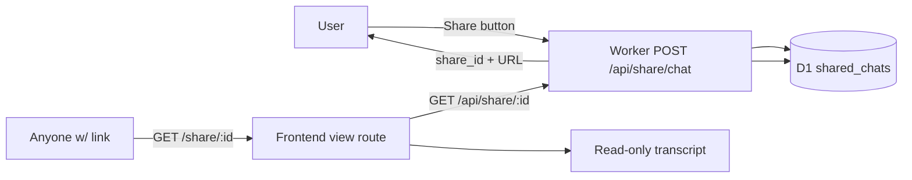

# Share Chat — Plan & Design

> **Transient in-flight runbook** (see root `AGENTS.md` → "Documentation policy —
> no `PLAN-*.md` rollups"): this file lives on the feature branch only and is
> **deleted on ship** — fold the still-live facts into `README.md` and the
> per-package `AGENTS.md` files in the implementation PR.

Explore a **share-a-chat** feature for the Lobster Copilot: a Share button in
the chat header turns the current conversation into a **public, unlisted,
read-only URL** that renders the transcript. Shared chats live in **D1** (not
the R2 lake), and the schema is designed so a future **"rerun this SQL on an
interval"** alerts feature can build on the same row without a migration
surprise.

This document is the exploration/design. Implementation is a follow-on PR.

---

## 1. Product flow



- **Share button** in the AiChat header (next to "New chat"), enabled once the
  conversation has ≥1 exchange. Clicking it POSTs the transcript to the Worker,
  which mints a high-entropy `share_id`, stores the snapshot in D1, and returns
  the canonical URL `/share/<share_id>`.
- **Share affordance**: the copy-link dialog (navigator.clipboard) plus a
  "View" action that navigates to the share URL so the user sees exactly what
  their recipient sees.
- **View route** `/share/:share_id`: a dedicated read-only page rendering the
  transcript (Markdown answers + collapsible SQL/result blocks), with a
  "Open in Copilot" CTA that deep-links back to the chat. No composer, no
  settings, no localStorage key — it is a public artifact.

**Access model — unlisted, not secret.**
`share_id` is cryptographic-entropy (base62 of ~18 bytes, like a GitHub gist
id), so the URL is an implicit capability: anyone with the link can view, and
nobody can enumerate shares. This matches the site's existing anonymous/free
ethos — no login, no personal data. The D1 row stores only the transcript
(no `ip`/`user_agent` — those belong to the private admin lake capture, see
§5). Recipients need no OpenRouter key to read a share.

---

## 2. D1 schema — `shared_chats` (robust for future alerts)

Migration `worker/migrations/0003_shared_chats.sql`. Designed to be the
**source of truth for a shared conversation** and the **anchor a future
`scheduled_alerts` table references** — so the alert feature needs no change
to this table.

```sql
CREATE TABLE IF NOT EXISTS shared_chats (
  share_id    TEXT PRIMARY KEY,   -- base62 ~18-byte entropy: the URL slug (implicit capability)
  chat_id     TEXT NOT NULL,      -- originating conversation id (matches options.chat_history)
  title       TEXT,               -- auto-derived (first question) / user-editable
  mode        TEXT NOT NULL,      -- 'free' | 'byok'
  model       TEXT,               -- model id that answered
  messages    TEXT NOT NULL,      -- JSON array [{role, content, sql?, tools?, ts?}] — the transcript
  source_sql  TEXT,               -- the "money" query (last assistant sql) denormalized for alert wiring
  created_ip  TEXT,               -- server-set abuse signal (CF-Connecting-IP); admin-only, NEVER served
  created_ua  TEXT,               -- server-set abuse signal (User-Agent); admin-only, NEVER served
  created_at  INTEGER NOT NULL,   -- epoch ms
  updated_at  INTEGER NOT NULL,   -- epoch ms; bumped on title/transcript edits
  expires_at  INTEGER             -- epoch ms; NULL = never (TTL for revocable shares)
);

CREATE INDEX IF NOT EXISTS idx_shared_chats_chat    ON shared_chats(chat_id);
CREATE INDEX IF NOT EXISTS idx_shared_chats_created ON shared_chats(created_at);
CREATE INDEX IF NOT EXISTS idx_shared_chats_ip      ON shared_chats(created_ip);
CREATE INDEX IF NOT EXISTS idx_shared_chats_expires ON shared_chats(expires_at);
```

**Why these fields — each earns its place:**

- **`share_id`** — the only thing a recipient needs. High entropy makes it
  unguessable; it is the auth. Stored as the PK so the URL lookup is a single
  point read.
- **`chat_id`** — links a share back to the conversation's R2 lake capture
  (`options.chat_history`, **shipped on main** — PR #70/#73) so the two stores
  stay correlatable without coupling them. `NULL` is fine for pre-capture chats.
- **`messages`** — the full transcript as JSON. Shape is an **extension of the
  shipped `ChatHistoryMessage`** (`{role, content, sql?, ts?}` in
  `frontend/src/api.ts`), widened with an optional `tools?` field:

  ```jsonc
  // per message (assistant only, optional):
  { "role": "assistant", "content": "…", "sql": "SELECT …",
    "tools": [ { "name": "run_query", "args": "…", "ok": true, "summary": "32 rows" } ] }
  ```

  **Tool-call capture does not exist today** — `ToolRow[]` in `AiChat.tsx` is
  live-only UI state (cleared per question, never persisted), so the shipped
  chat-history rows and shares would both be tool-free. Adding it is purely
  additive to this JSON blob (no migration), but requires the client to
  snapshot completed `ToolRow`s into the assistant message before it clears
  them. Recommend: v1 shares show messages + SQL only (already available);
  tool-call display is a small follow-on that the schema already tolerates.
- **`source_sql`** — **this is the alerts-ready keystone.** Denormalized last
  executed SQL. A future alert is "rerun `source_sql` on an interval and
  notify me when <condition>", so having the query as a first-class column
  (not buried in a JSON blob) lets the scheduler read it without parsing. Chosen
  over a general `saved_queries` table because the *share* is the natural
  unit a user wants to alert on ("share this and alert me when it changes").
- **`expires_at`** — optional TTL gives a cheap "unshare" lever (revocable
  links) without a separate permission model. `NULL` = permanent.

### Size budget — the D1 2 MB row limit is the real constraint

D1 caps a string/BLOB **and an entire table row at 2,000,000 bytes** (official
limits page). The shipped chat-history capture allows **100 messages × 20,000
chars** of content + another 20,000 of sql each — a worst case of ~4 MB of
JSON, **2× over the D1 row ceiling**. The R2 lake has no such per-row limit
(which is why the pipeline target can keep loose caps); the share row in D1
cannot.

Hard rules for the share endpoint — **all sizes measured in UTF-8 bytes, never
JS string length** (`JSON.stringify().length` counts UTF-16 code units; CJK /
emoji content expands 2–3 bytes per unit, so a 1.5M-unit string can store up
to ~4.5 MB and blow the INSERT). Measure with
`new TextEncoder().encode(json).byteLength`:

1. **Per-share byte budget:** reject (413) or truncate when the serialized
   `messages` JSON exceeds **1.2 MB of UTF-8 bytes**. Truncation trims
   **oldest turns first** (a share is judged by its tail), then drops `sql`
   from older assistant messages before touching the newest exchange.
   Budget choice: at the per-field caps (§3) a full 100-message transcript is
   ~1.0–1.5 MB of ASCII bytes plus JSON overhead — so 1.2 MB means truncation
   engages deterministically near the max, which is *desired*; never raise it
   above ~1.7 MB because the whole row (messages + `source_sql` + columns)
   must stay under 2,000,000 bytes.
2. **Tighter per-field caps than the lake row:** `content` ≤ 5,000 chars,
   `sql` ≤ 10,000 chars, `tools` ≤ 20 entries per message — the share is a
   display artifact; nobody needs a 20k-char SQL blob in a link.
3. **Enforce server-side in `normalizeShareRecord`** (the client cannot be
   trusted) — the second validation pass after the shipped 20k normalizer
   (whose caps are *looser*, so they cannot be relied on alone for shares —
   see §3). Also check the **assembled row** (JSON bytes + `source_sql` +
   column overhead) against 2,000,000 bytes before INSERT, so a share can
   never 500 on a D1 failure after passing the message check.

The `source_sql` column is exempt from the message budget (one row's last SQL
only, already ≤ 10k after the per-field cap) but **counts against the row
total**.

### Future `scheduled_alerts` (RECOMMENDED, NOT created now)

Do not create this table in the share PR — it is the *extension point* that
justifies the share schema above. When the alert feature is built it lands as
its own migration and references a share:

```sql
-- FUTURE (illustrative) — not part of this PR.
-- D1 enforces foreign keys by default, so the FK MUST declare ON DELETE
-- semantics or the future DELETE /api/share/:id fails whenever an alert
-- references the share (verified: D1 ≈ PRAGMA foreign_keys=on).
CREATE TABLE IF NOT EXISTS scheduled_alerts (
  id          TEXT PRIMARY KEY,
  share_id    TEXT NOT NULL REFERENCES shared_chats(share_id) ON DELETE CASCADE,
  sql         TEXT NOT NULL,      -- snapshot of shared_chats.source_sql at creation
  interval    TEXT NOT NULL,      -- human cron: '5m' | 'hourly' | 'daily @ 9:30 ET' …
  condition   TEXT,               -- optional: 'vol_rank_pct > 90' style predicate
  notify_to   TEXT,               -- email/webhook; empty = none yet
  next_run_at INTEGER,
  last_run_at INTEGER,
  created_at  INTEGER NOT NULL
);
```

`ON DELETE CASCADE` = deleting a share deletes its alerts (the alert owns no
independent data — it is a schedule over the share's `source_sql`). If alerts
should survive share deletion (alert SQL is a snapshot, so it can), use
`ON DELETE SET NULL` on `share_id` and treat `NULL` as "detached alert". The
alert migration makes this choice explicitly; `shared_chats` itself never
changes.

The point of §2 is that the share PR produces a schema where the alert
feature is **purely additive** — it never has to alter `shared_chats` or
re-derive a query.

---

## 3. Worker endpoints (`worker/src/index.ts`)

Reuse the existing D1/JSON/CORS patterns (`env.SCHEMA_DB.prepare(…).bind(…).run()`,
`json(env, …)`, `cors(env, …)`).

### `POST /api/share/chat` — create a share

Body is the **full `ChatHistoryRecord`** as shipped (chat_id, mode, model,
**started_at, ended_at**, messages) — the shared normalizer
`normalizeChatHistoryRecord` **requires `started_at`/`ended_at` ISO
timestamps and a non-empty messages array**, so omitting them (as a plain
`{chat_id, mode, model, messages}` body) would 400 every share POST.

1. **Pass 1 — shared normalizer:** call the shipped
   `normalizeChatHistoryRecord` verbatim (strip to `{role, content, sql, ts}`,
   cap messages at 100, content at 20k chars). This gives identical validation
   — and identical failure modes — to the R2 capture.
2. **Pass 2 — share-only tightening (`normalizeShareRecord`):** the shipped
   caps are **looser than the share row allows** (20k/20k, no byte budget), so
   a second pass applies the §2 per-field caps (`content` ≤ 5,000, `sql` ≤
   10,000, `tools` ≤ 20/message) to **every** message, then the UTF-8 byte
   check on the serialized JSON (1.2 MB) and the assembled row (2 MB). A
   message that passed pass 1 untouched gets trimmed here.
3. `share_id = base62Encode(crypto.getRandomValues(new Uint8Array(18)))`.
4. `source_sql` = the last assistant message's `sql`.
5. `created_ip` / `created_ua` from the request headers (never the body).
6. `INSERT INTO shared_chats (…)` with `created_at = updated_at = Date.now()`.
7. Return `{ share_id, url: "/share/" + share_id }`.

Best-effort semantics: a D1 write failure returns 502 (unlike chat-history's
buffer-to-D1 — that buffer exists to not lose *analytics*; a share the user
explicitly requested must either succeed or fail loudly so they can retry).

### `GET /api/share/:id` — public read

Route via `path.startsWith("/api/share/")` (mirrors `/api/symbol/`).

1. `SELECT … FROM shared_chats WHERE share_id = ?1`.
2. Missing or `expires_at` passed → 404 `{ error: "not found" }`.
3. Return `{ share_id, title, mode, model, created_at, messages (parsed), source_sql }`.

No auth — the id is the capability. Cache `Cache-Control: public, max-age=60`
(via `json(env, …)` default) so repeated recipients don't re-hit D1.

### Abuse tracking — fingerprinting: NO, server-side signals: YES

**Decision: no client fingerprinting.** Canvas/WebGL/font fingerprinting is (a)
privacy-hostile for a site whose positioning is "no login, no personal data"
(the Settings privacy note says exactly that), (b) trivially defeated by a
determined abuser (headless browsers, rotating fingerprints, incognito), and
(c) useless for the actual abuse surface, which is **bulk share creation** —
the abuser is a script, not a browser identity. The client is already
untrusted for the chat-history capture (server sets `ip`/`user_agent`, never
the client); the same rule applies here.

**What we do instead — server-side abuse signals, additive cheap levers:**

1. **`created_ip` (CF-Connecting-IP) + `created_ua` on the share row** — the
   exact pattern the shipped chat-history capture uses (`index.ts` reads
   `CF-Connecting-IP` / `User-Agent`, never accepts them from the body). These
   are **admin-only**: excluded from `GET /api/share/:id` responses and never
   rendered client-side. They make abuse *queryable*:
   `SELECT created_ip, COUNT(*) FROM shared_chats GROUP BY created_ip ORDER BY 2 DESC`
   — the owner can see a spammer without any browser cooperation. Indexed in
   migration 0003 (`idx_shared_chats_ip`) so the query (and the D1 rate check
   below) never full-scans.
2. **Reject oversized bodies BEFORE parsing** — check
   `Content-Length`/`request.body` byte length and return 413 immediately if
   the raw body exceeds ~1.3 MB, *before* `req.json()` (Workers parse the full
   body either way, but this bounds the JSON.parse cost and keeps the D1 row
   budget honest). Costs for a single POST are capped by the §2 byte/field
   budgets regardless.
3. **Synchronous D1 per-IP rate check returning 429** — `created_ip` is
   already stored, so before INSERT run
   `SELECT COUNT(*) FROM shared_chats WHERE created_ip = ?1 AND created_at > ?2`
   (indexed) and reject the POST when a recent threshold (e.g. 20 shares /
   10 min) is crossed. Unlike the in-isolate Map this survives isolate
   recycling and works across colocations — the honest lever for bulk
   creation. Keep the in-isolate Map as a cheap first filter, but it is
   **not** a stand-alone control (it dies with the isolate and one IP's
   consecutive requests routinely land on different isolates).
4. **Turnstile gate** — none exists anywhere in the Worker today
   (the `/api/free/*` credit gate is an OpenRouter balance check, not
   anti-bot). Ship the share endpoint with levers 1–3; add a Turnstile gate
   to `/api/free/*` **and** `/api/share/chat` together when anti-bot demand
   shows up — one shared gate, server verified.

If a real spammer appears despite 1–3, the additive next step is an admin
review surface (`GET /api/admin/shares?ip=…`, mirroring the shipped
`/api/admin/chat_history` endpoint) — still no fingerprinting, still no client
trust. Fingerprinting stays off the table unless the owner explicitly decides
the privacy cost is worth it, which the current product stance argues
against.

---

## 4. Frontend (`frontend/src/`)

Follow `frontend/AGENTS.md` (Astryx components + tokens, no raw `<div>` layout).

### Share button — `AiChat.tsx`

- `IconButton` (lucide `Share2`) in the header action row, next to "New chat".
- `disabled` until `msgs.some(m => m.role === 'assistant')`.
- On click: build the transcript with the **existing** chat-history trimmer
  (same `ChatHistoryMessage[]` shape), `api.shareChat(record)`, then show a
  small Astryx dialog/tooltip with the copyable URL + a "View" navigate to
  `/share/<share_id>`.

### API client — `api.ts`

- `ShareChatResponse { share_id: string; url: string }`.
- `api.shareChat(record: ChatHistoryRecord)` → POST `/api/share/chat`.
- `api.sharedChat(id: string)` → GET `/api/share/<id>` → `SharedChat` type.

### View route — `router.tsx` + new `SharedChat.tsx`

- `shareRoute = createRoute({ path: '/share/$shareId', component: SharedChat })`,
  added to the root child tree next to the other top-level routes.
- `SharedChat` component: `useParams` → `api.sharedChat(id)` → render the
  transcript read-only (reuse `Markdown` for answers, the existing SQL/result
  display block, user bubbles). Loading + 404/expired states. A minimal header
  with a "New chat" / "Open in Copilot" link back to `/`.

The chat-history `saveTranscript` already snapshots every turn into state, so
the Share button has the full transcript in hand — no new capture logic.

---

## 5. Relationship to the R2 chat-history capture

The **Copilot chat-history capture is shipped** (PR #70, hardened by #73 —
"buffer-first" ingest with background publish): `POST /api/chat/history`
publishes per-turn records to `options.chat_history` via the
`cboe_chat_history_v2` pipeline, **admin-only** (excluded from `/api/tables`,
blocked in `/api/query` without `ADMIN_TOKEN`, read via
`GET /api/admin/chat_history`). Migration `0002_pending_chat_history.sql`
(buffered rows on pipeline failure) is already applied to `origin/main`.

Everything the share feature needs from it is **already on main**:

- `chat_id` — the browser generates a per-conversation `crypto.randomUUID()`
  (`AiChat.tsx`) and sends it with every turn; the share POST reuses it as-is.
- The transcript normalizer (`normalizeChatHistoryRecord` in `index.ts`) —
  caps, stripping, and validation are shared verbatim; the share endpoint
  calls the same path (or a thin wrapper that adds the share fields).
- `ChatHistoryMessage`/`ChatHistoryRecord` types in `frontend/src/api.ts` —
  the share API extends these rather than inventing parallel types.

The two stores are deliberately **different** and this is correct:

| | R2 `options.chat_history` | D1 `shared_chats` |
|---|---|---|
| Purpose | private admin analytics/abuse | public unlisted artifact |
| Access | `ADMIN_TOKEN` only | link-capability (public) |
| Rows | one per turn, full series | one per share, snapshot |
| PII | `ip` / `user_agent` captured | `created_ip`/`created_ua` captured server-side, admin-only, never served |
| Read path | `GET /api/admin/chat_history` | `GET /api/share/:id` |

A shared chat is a **projection** of a conversation, not the analytics copy —
so it lives in D1, is keyed by a public slug, and carries only what a viewer
needs to render it.

---

## 6. Migration naming

`origin/main` has `0001_schema_cache.sql` + `0002_pending_chat_history.sql`
(chat-history, shipped). This feature uses **`0003_shared_chats.sql`** —
sequential after the shipped set, no collision. The schema is additive only;
no migration ever alters `shared_chats` once it lands.

---

## 7. Acceptance criteria

1. `npx wrangler dev` + curl: `POST /api/share/chat` with a small transcript
   returns `{ share_id, url }`; `GET /api/share/<id>` returns the stored chat;
   an unknown/past-expiry id returns 404.
2. D1: after the POST, `SELECT * FROM shared_chats` shows one row with
   `source_sql` = last assistant sql, `messages` parsed back to the transcript,
   `created_ip`/`created_ua` populated from the request headers.
3. **Size budget:** a transcript whose serialized JSON exceeds **1.2 MB of
   UTF-8 bytes** is rejected (413) or truncated oldest-first; a per-message
   content/sql over the per-field caps is trimmed, not dropped; the **assembled
   row** (JSON + `source_sql`) is verified under 2,000,000 bytes before INSERT.
   A non-ASCII transcript (CJK/emoji) that fits under 1.2 MB of *bytes* stores
   cleanly (byte-measured, not string-length measured).
4. UI: Share button enabled after a chat turn; clicking it produces a copyable
   URL; navigating to `/share/<id>` renders the read-only transcript (user +
   assistant bubbles, SQL visible).
5. No key required to view a share (loads in a fresh incognito tab).
6. Privacy: `ip`/`user_agent` appear **nowhere** in `GET /api/share/:id`
   responses (abuse columns are server-only); the lake `chat_history` table
   stays admin-only.
7. **Abuse:** an oversized raw body (> ~1.3 MB) is rejected before JSON parse
   (413); a D1-backed per-IP check (COUNT over `created_ip` + recent window)
   returns 429 past the threshold; `idx_shared_chats_ip` serves both.
8. Frontend build/lint + worker `tsc` clean; preview deploy HTTP 200.

## 8. Open questions / follow-ups

- **Revocation:** `expires_at` exists in v1 but **no endpoint sets it**
  (no edit/delete route ships) — "revocable links" is unreachable until
  `DELETE /api/share/:id` (+ an expiry sweep job) lands. Both are additive on
  this schema; the delete must respect the future `scheduled_alerts` FK
  (CASCADE — alerts die with the share; see §2).
- **Title:** auto-derive from the first user question now; editing later.
- **Tool-call capture:** v1 renders messages + SQL; capturing `ToolRow`s into
  the transcript (so shares show what tools ran) is a small additive follow-on
  — schema already tolerates it via the `tools?` field.
- **Rate limiting:** D1-backed per-IP 429 (not just the ephemeral in-isolate
  Map) ships with the feature; a Turnstile gate extends to
  `/api/free/*` **and** `/api/share/chat` together when anti-bot demand shows
  up. Client fingerprinting stays off the table (§3).
- **Alert feature** is explicitly out of scope here — §2 proves the schema
  accommodates it additively (including FK delete semantics); build it as its
  own PR when the time comes.