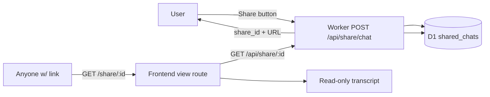

# Share Chat — Plan & Design

Explore a **share-a-chat** feature for the Lobster Copilot: a Share button in
the chat header turns the current conversation into a **public, unlisted,
read-only URL** that renders the transcript. Shared chats live in **D1** (not
the R2 lake), and the schema is designed so a future **"rerun this SQL on an
interval"** alerts feature can build on the same row without a migration
surprise.

This document is the exploration/design. Implementation is a follow-on PR.

---

## 1. Product flow



- **Share button** in the AiChat header (next to "New chat"), enabled once the
  conversation has ≥1 exchange. Clicking it POSTs the transcript to the Worker,
  which mints a high-entropy `share_id`, stores the snapshot in D1, and returns
  the canonical URL `/share/<share_id>`.
- **Share affordance**: the copy-link dialog (navigator.clipboard) plus a
  "View" action that navigates to the share URL so the user sees exactly what
  their recipient sees.
- **View route** `/share/:share_id`: a dedicated read-only page rendering the
  transcript (Markdown answers + collapsible SQL/result blocks), with a
  "Open in Copilot" CTA that deep-links back to the chat. No composer, no
  settings, no localStorage key — it is a public artifact.

**Access model — unlisted, not secret.**
`share_id` is cryptographic-entropy (base62 of ~18 bytes, like a GitHub gist
id), so the URL is an implicit capability: anyone with the link can view, and
nobody can enumerate shares. This matches the site's existing anonymous/free
ethos — no login, no personal data. The D1 row stores only the transcript
(no `ip`/`user_agent` — those belong to the private admin lake capture, see
§5). Recipients need no OpenRouter key to read a share.

---

## 2. D1 schema — `shared_chats` (robust for future alerts)

Migration `worker/migrations/0003_shared_chats.sql`. Designed to be the
**source of truth for a shared conversation** and the **anchor a future
`scheduled_alerts` table references** — so the alert feature needs no change
to this table.

```sql
CREATE TABLE IF NOT EXISTS shared_chats (
  share_id    TEXT PRIMARY KEY,   -- base62 ~18-byte entropy: the URL slug (implicit capability)
  chat_id     TEXT NOT NULL,      -- originating conversation id (matches options.chat_history)
  title       TEXT,               -- auto-derived (first question) / user-editable
  mode        TEXT NOT NULL,      -- 'free' | 'byok'
  model       TEXT,               -- model id that answered
  messages    TEXT NOT NULL,      -- JSON array [{role, content, sql?, ts?}] — the transcript
  source_sql  TEXT,               -- the "money" query (last assistant sql) denormalized for alert wiring
  created_at  INTEGER NOT NULL,   -- epoch ms
  updated_at  INTEGER NOT NULL,   -- epoch ms; bumped on title/transcript edits
  expires_at  INTEGER             -- epoch ms; NULL = never (optional TTL for revocable shares)
);

CREATE INDEX IF NOT EXISTS idx_shared_chats_chat ON shared_chats(chat_id);
CREATE INDEX IF NOT EXISTS idx_shared_chats_created ON shared_chats(created_at);
```

**Why these fields — each earns its place:**

- **`share_id`** — the only thing a recipient needs. High entropy makes it
  unguessable; it is the auth. Stored as the PK so the URL lookup is a single
  point read.
- **`chat_id`** — links a share back to the conversation's R2 lake capture
  (`options.chat_history`) when that feature lands. Keeps the two stores
  correlatable without coupling them. `NULL` is fine pre-merge (see §5).
- **`messages`** — the full transcript as JSON, the same `{role, content, sql,
  ts}` shape the chat-history capture already produces (`ChatHistoryMessage`
  in `frontend/src/api.ts`). Reuses the existing client trimmer, so the worker
  validation is shared with `/api/chat/history`.
- **`source_sql`** — **this is the alerts-ready keystone.** Denormalized last
  executed SQL. A future alert is "rerun `source_sql` on an interval and
  notify me when <condition>", so having the query as a first-class column
  (not buried in a JSON blob) lets the scheduler read it without parsing. Chosen
  over a general `saved_queries` table because the *share* is the natural
  unit a user wants to alert on ("share this and alert me when it changes").
- **`expires_at`** — optional TTL gives a cheap "unshare" lever (revocable
  links) without a separate permission model. `NULL` = permanent.

### Future `scheduled_alerts` (RECOMMENDED, NOT created now)

Do not create this table in the share PR — it is the *extension point* that
justifies the share schema above. When the alert feature is built it lands as
its own migration and references a share:

```sql
-- FUTURE (illustrative) — not part of this PR.
CREATE TABLE IF NOT EXISTS scheduled_alerts (
  id          TEXT PRIMARY KEY,
  share_id    TEXT NOT NULL REFERENCES shared_chats(share_id),
  sql         TEXT NOT NULL,      -- snapshot of shared_chats.source_sql at creation
  interval    TEXT NOT NULL,      -- human cron: '5m' | 'hourly' | 'daily @ 9:30 ET' …
  condition   TEXT,               -- optional: 'vol_rank_pct > 90' style predicate
  notify_to   TEXT,               -- email/webhook; empty = none yet
  next_run_at INTEGER,
  last_run_at INTEGER,
  created_at  INTEGER NOT NULL
);
```

The point of §2 is that the share PR produces a schema where the alert
feature is **purely additive** — it never has to alter `shared_chats` or
re-derive a query.

---

## 3. Worker endpoints (`worker/src/index.ts`)

Reuse the existing D1/JSON/CORS patterns (`env.SCHEMA_DB.prepare(…).bind(…).run()`,
`json(env, …)`, `cors(env, …)`).

### `POST /api/share/chat` — create a share

Body mirrors `/api/chat/history`'s `ChatHistoryRecord` (chat_id, mode, model,
messages). Validation is shared with the chat-history normalizer (strip to
`{role, content, sql, ts}`, cap messages at 100, content at 20k chars).

1. Validate transcript (existing helpers on the chat-history branch).
2. `share_id = base62Encode(crypto.getRandomValues(new Uint8Array(18)))`.
3. `source_sql` = the last assistant message's `sql`.
4. `INSERT INTO shared_chats (…)` with `created_at = updated_at = Date.now()`.
5. Return `{ share_id, url: "/share/" + share_id }`.

Best-effort semantics: a D1 write failure returns 502 (unlike chat-history's
buffer-to-D1 — that buffer exists to not lose *analytics*; a share the user
explicitly requested must either succeed or fail loudly so they can retry).

### `GET /api/share/:id` — public read

Route via `path.startsWith("/api/share/")` (mirrors `/api/symbol/`).

1. `SELECT … FROM shared_chats WHERE share_id = ?1`.
2. Missing or `expires_at` passed → 404 `{ error: "not found" }`.
3. Return `{ share_id, title, mode, model, created_at, messages (parsed), source_sql }`.

No auth — the id is the capability. Cache `Cache-Control: public, max-age=60`
(via `json(env, …)` default) so repeated recipients don't re-hit D1.

### Abuse posture

Public unauthenticated POST = a spam vector (like `/api/free/*`). The
`/api/free/*` plan already anticipates Turnstile + IP rate limits (§6.4 of
PLAN-FREE-CHATS.md); the share endpoint should re-use whatever gate lands
there. A cheap immediate lever: cap shares per IP in-isolate (a `Map` of
recent share POSTs, like the existing `cached()` helper) and a body-size cap.
Not built in this PR — noted as required hardening before wide rollout.

---

## 4. Frontend (`frontend/src/`)

Follow `frontend/AGENTS.md` (Astryx components + tokens, no raw `<div>` layout).

### Share button — `AiChat.tsx`

- `IconButton` (lucide `Share2`) in the header action row, next to "New chat".
- `disabled` until `msgs.some(m => m.role === 'assistant')`.
- On click: build the transcript with the **existing** chat-history trimmer
  (same `ChatHistoryMessage[]` shape), `api.shareChat(record)`, then show a
  small Astryx dialog/tooltip with the copyable URL + a "View" navigate to
  `/share/<share_id>`.

### API client — `api.ts`

- `ShareChatResponse { share_id: string; url: string }`.
- `api.shareChat(record: ChatHistoryRecord)` → POST `/api/share/chat`.
- `api.sharedChat(id: string)` → GET `/api/share/<id>` → `SharedChat` type.

### View route — `router.tsx` + new `SharedChat.tsx`

- `shareRoute = createRoute({ path: '/share/$shareId', component: SharedChat })`,
  added to the root child tree next to the other top-level routes.
- `SharedChat` component: `useParams` → `api.sharedChat(id)` → render the
  transcript read-only (reuse `Markdown` for answers, the existing SQL/result
  display block, user bubbles). Loading + 404/expired states. A minimal header
  with a "New chat" / "Open in Copilot" link back to `/`.

The chat-history `saveTranscript` already snapshots every turn into state, so
the Share button has the full transcript in hand — no new capture logic.

---

## 5. Relationship to the R2 chat-history capture

The user's mental model ("we now have chat history on R2") refers to the
**Copilot chat-history capture** (`feat/chat-history-lake-table`, commit
`073f4f3`): per-turn records published to `options.chat_history` via the
`cboe_chat_history_v2` pipeline, **admin-only** (excluded from `/api/tables`,
blocked in `/api/query`, read via `GET /api/admin/chat_history` with
`ADMIN_TOKEN`).

> **Note:** that work is on an **unmerged branch**, not `origin/main` at the
> time of writing. The share plan is designed to land either order:
>
> - **Share first, history later:** the share rows still carry `chat_id` and a
>   `chat_id` PK-compatible index; the history merge then just correlates.
> - **History first, share later:** the share worker reuses the branch's
>   transcript normalizer and `chat_id` generation verbatim.

The two stores are deliberately **different** and this is correct:

| | R2 `options.chat_history` | D1 `shared_chats` |
|---|---|---|
| Purpose | private admin analytics/abuse | public unlisted artifact |
| Access | `ADMIN_TOKEN` only | link-capability (public) |
| Rows | one per turn, full series | one per share, snapshot |
| PII | `ip` / `user_agent` captured | none (other than the user's own words) |
| Read path | `GET /api/admin/chat_history` | `GET /api/share/:id` |

A shared chat is a **projection** of a conversation, not the analytics copy —
so it lives in D1, is keyed by a public slug, and carries only what a viewer
needs to render it.

---

## 6. Migration naming

`origin/main` currently has `0001_schema_cache.sql`. The unmerged chat-history
branch adds `0002_pending_chat_history.sql`. This PR uses **`0003_shared_chats.sql`**
so the two don't collide regardless of merge order (wrangler applies migrations
in filename order; two `0002`s would double-apply). If the history branch merges
first, `0003` is still correct.

---

## 7. Acceptance criteria

1. `npx wrangler dev` + curl: `POST /api/share/chat` with a small transcript
   returns `{ share_id, url }`; `GET /api/share/<id>` returns the stored chat;
   an unknown/past-expiry id returns 404.
2. D1: after the POST, `SELECT * FROM shared_chats` shows one row with
   `source_sql` = last assistant sql, `messages` parsed back to the transcript.
3. UI: Share button enabled after a chat turn; clicking it produces a copyable
   URL; navigating to `/share/<id>` renders the read-only transcript (user +
   assistant bubbles, SQL visible).
4. No key required to view a share (loads in a fresh incognito tab).
5. Privacy: the share row contains no `ip`/`user_agent`; the lake
   `chat_history` table stays admin-only.
6. Frontend build/lint + worker `tsc` clean; preview deploy HTTP 200.

## 8. Open questions / follow-ups

- **Share scope creep:** should a share be revocable (delete endpoint) or is
  `expires_at` enough? (Recommend: `DELETE /api/share/:id` + `expires_at`
  later, both trivial on this schema.)
- **Title:** auto-derive from the first user question now; editing later.
- **Rate limiting:** ship unthrottled for the initial rollout, add the
  `/api/free/*` Turnstile/IP gate when it lands.
- **Alert feature** is explicitly out of scope here — §2 proves the schema
  accommodates it additively; build it as its own PR when the time comes.